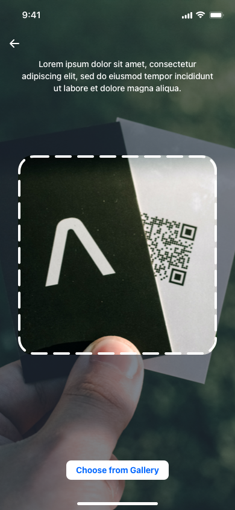

# MobilliumQRCodeReader

[](https://github.com/mobillium/MobilliumQRCodeReader/actions/workflows/ci.yml)
[](https://cocoapods.org/pods/MobilliumQRCodeReader)
[](https://img.shields.io/badge/Swift_Package_Manager-compatible-orange?style=flat-square)
[](https://github.com/Carthage/Carthage)
[](https://cocoapods.org/pods/MobilliumQRCodeReader)
[](https://cocoapods.org/pods/MobilliumQRCodeReader)



## Example

To run the example project, clone the repo, and run `pod install` from the Example directory first.

## Requirements
- iOS 11.0+
- Swift 5.0+

## Installation

#### CocoaPods

MobilliumQRCodeReader is available through [CocoaPods](https://cocoapods.org). To install
it, simply add the following line to your Podfile:

```ruby
pod 'MobilliumQRCodeReader'
```

#### Swift Package Manager

The [Swift Package Manager](https://swift.org/package-manager/) is a tool for automating the distribution of Swift code and is integrated into the `swift` compiler.    
Once you have your Swift package set up, adding MobilliumQRCodeReader as a dependency is as easy as adding it to the `dependencies` value of your `Package.swift`.

```swift
dependencies: [
    .package(url: "https://github.com/mobillium/MobilliumQRCodeReader.git", .upToNextMajor(from: "1.1.0"))
]
```

### Carthage

[Carthage](https://github.com/Carthage/Carthage) is a decentralized dependency manager that builds your dependencies and provides you with binary frameworks. To integrate MobilliumQRCodeReader into your Xcode project using Carthage, specify it in your `Cartfile`:

```ogdl
github "mobillium/MobilliumQRCodeReader"
```

## Usage
MobilliumQRCodeReader comes with these configs which you can customize for your requirements or you can continue with default values.     
Create own QRCodeReaderViewController and get result from QRCodeReaderDelegate.
- PreviewLayer
- CloseButton
- InfoLabel
- GalleryButton
- SettingsAlert

Basic usage:
```swift
    let viewController = QRCodeReaderViewController()
    viewController.delegate = self
    viewController.present(on: self)
```

Advanced usage:
```swift
    let closeButton = QRCodeReaderConfig.CloseButton(image: ImageProvider.getCloseImage(),
                                                    tintColor: .white,
                                                    isHidden: false)
        
    let infoLabel = QRCodeReaderConfig.InfoLabel(text: "Lorem ipsum dolor sit amet, consectetur adipiscing elit",
                                                textColor: .white,
                                                font: .systemFont(ofSize: 14),
                                                isHidden: false)
        
    let galleryButton = QRCodeReaderConfig.GalleryButton(title: "Choose from Gallery",
                                                        titleColor: .systemBlue,
                                                        font: .systemFont(ofSize: 14, weight: .semibold),
                                                        backgroundColor: .white,
                                                        cornerRadius: 8,
                                                        isHidden: false,
                                                        height: 32)
        
    let previewLayer = QRCodeReaderConfig.PreviewLayer(backgroundColor: UIColor.gray.withAlphaComponent(0.3).cgColor,
                                                        lineWidth: 4,
                                                        lineColor: .white,
                                                           marginSize: 32,
                                                           cornerRadius: 24,
                                                           lineDashPattern: [25, 10])
        
    let settingsAlert = QRCodeReaderConfig.SettingsAlert(title: nil,
                                                             message: "Go to Settings?",
                                                             actionButtonTitle: "Settings",
                                                             cancelButtonTitle: "Cancel")
        
    let config = QRCodeReaderConfig(closeButton: closeButton,
                                           infoLabel: infoLabel,
                                           galleryButton: galleryButton,
                                           previewLayer: previewLayer,
                                           settingsAlert: settingsAlert)
    let viewController = QRCodeReaderViewController(config: config)
    viewController.delegate = self
    viewController.present(on: self)
```


QRCodeReaderDelegate:
```swift
    func qrCodeReader(_ viewController: UIViewController, didSuccess qrCode: String)
    func qrCodeReaderFailed(_ viewController: UIViewController)
    func qrCodeReaderClosed(_ viewController: UIViewController)
```

## License

MobilliumQRCodeReader is available under the MIT license. See the LICENSE file for more info.
